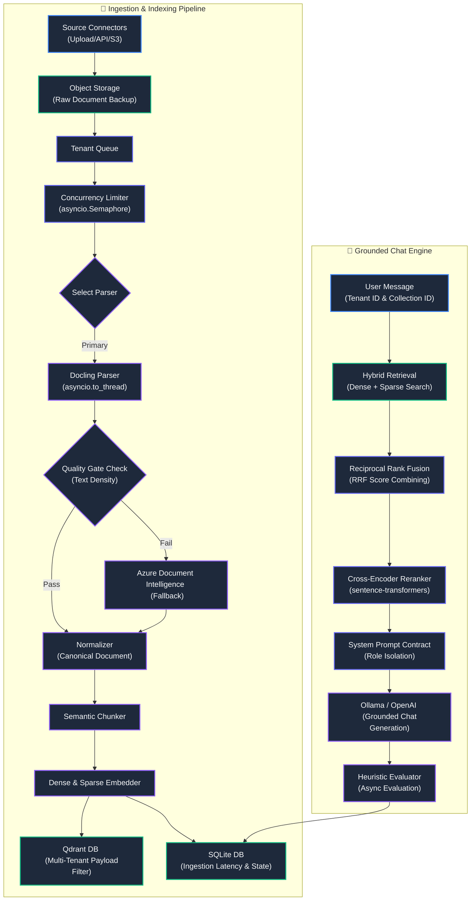

# System Design & Architecture Decisions

This document details the design patterns, trade-offs, and multi-tenant scaling strategies implemented in this take-home RAG ingestion pipeline.

---

## 🏛️ System Architecture Diagram

---

## 🚦 Pipeline State Machine

Every document flows through an explicit, auditable state machine tracked in the Metadata database. This guarantees reproducibility and enables pipeline resumes in case of failure.

1. **RECEIVED**: Document bits have arrived at the API boundary.
2. **STORED**: Raw bytes deposited safely in Object Storage (`blob_store`).
3. **QUEUED**: Job dispatched to the async worker pool.
4. **PARSING**: Document content is currently being extracted (Docling/ADI).
5. **QUALITY_CHECK**: Heuristics checking if parser output is garbage.
6. **NORMALIZED**: Raw output translated to the unified `CanonicalDocument` schema.
7. **CHUNKING**: Content is semantically partitioned into token-limited blocks.
8. **EMBEDDING**: Blocks are passed through `all-MiniLM` and `BM25`.
9. **INDEXING**: Vectors and payloads deposited into Qdrant.
10. **READY**: Document is live for RAG querying.

---

## 💎 Key Architecture Decisions

### 1. Document Parsing & Quality-Gate Fallback with Thread Offloading
*   **Decision**: We use **Docling (IBM)** as the primary parser and **Azure Document Intelligence (ADI)** as a backup fallback, offloading CPU-heavy conversion to worker threads using `asyncio.to_thread`.
*   **Rationale**: Naive text extraction destroys tables and layout relations, leading to incorrect RAG context. Docling converts complex PDFs/DOCX files into cleanly structured dictionaries preserving tables. To prevent heavy PyTorch OCR operations from blocking Uvicorn's async event loop, conversion is offloaded to worker threads, ensuring status polling endpoints remain 100% responsive. An automated **Quality Gate** assesses text density to trigger fallback if necessary.

### 2. Tenant Concurrency & Fairness
*   **Decision**: Created a `TenantFairScheduler` that leverages `asyncio.Semaphore` per tenant to limit concurrent jobs.
*   **Rationale**: In an enterprise RAG system, one tenant uploading 100,000 files must not exhaust the cluster. The Semaphore guarantees concurrency limits (preventing CPU starvation). Note: True round-robin cross-tenant fairness is slated for the production architecture using a dedicated queueing layer (like RabbitMQ) rather than an in-memory Semaphore.

### 3. Database-Level Hybrid Retrieval, Reranking & ACLs
*   **Decision**: Configured Qdrant with named vectors (`dense` and `sparse`), filtering on indexed payloads (`tenant_id`, `access_groups`), followed by a `CrossEncoder` rescoring phase.
*   **Rationale**: Offloading the sparse vector index and Role-Based Access Control (RBAC) payload filtering directly to Qdrant ensures highly efficient multi-tenant queries at scale. The results are then passed through a local `sentence-transformers` cross-encoder to guarantee precision before being injected into the LLM context.

### 4. Enterprise System Prompt Contract
*   **Decision**: Implemented a multi-role chat message structure separating system role guidelines from user context.
*   **Rationale**: Following enterprise AI engineering best practices, system instructions (grounding constraints, explicit refusal messages, and citation formatting) are isolated in `{"role": "system"}`. This prevents prompt instruction overload on smaller LLMs and strictly mitigates token leakage.

### 5. Asynchronous Evaluation
*   **Decision**: Configured `HeuristicEvaluator` to score chat queries for Faithfulness, Relevance, and Precision, executing evaluations via `asyncio.create_task`.
*   **Rationale**: LLM evaluation requires multiple round-trip prompts, adding 4–8 seconds of latency. Triggering evaluation asynchronously ensures immediate chat responses for the user. (Note: For this local demo, we use `asyncio.create_task` and token-overlap heuristics; production systems use durable worker queues and LLM-as-a-judge patterns).

### 6. Multi-Tenant Overrides & Metadata Naming Isolation
*   **Decision**: Isolated custom user overrides (Access groups, fallback thresholds, semantic chunk sizes) from SQLAlchemy's declarative namespace by storing configs in a dedicated `metadata_dict` column.
*   **Rationale**: SQLAlchemy models reserve the `.metadata` attribute for declarative schema catalogs. Naming a column `metadata` creates a namespace collision that results in fatal `AttributeError` exceptions when queried. Renaming this field to `metadata_dict` and wrapping database fetch methods with robust `.scalars().first()` lookups ensures safe, collision-free parameter overrides on a per-tenant, per-file basis.

---

## 📈 Scaling Strategy

Handling millions of documents from hundreds of tenants requires breaking the monolith:
1. **Horizontal Worker Scaling**: The current `WorkerPool` would be replaced with a distributed message broker (e.g., Kafka, RabbitMQ) and independent worker nodes handling parsing and embedding.
2. **Queue Partitioning by Tenant**: To ensure strict fairness, message queues would be partitioned by `tenant_id` to prevent "noisy neighbor" starvation.
3. **Sharding Vector Store**: Qdrant would be deployed in a clustered configuration, partitioned by `tenant_id` if tenants have vastly different data volumes, or standard sharding to distribute search load.

---

## 🚨 Failure Modes & Recovery

1. **Parser OOM (Out of Memory)**: Docling can spike RAM on 1,000+ page PDFs. *Recovery*: Run parsers in isolated containers with cgroups memory limits and restart policies.
2. **Database Connection Loss**: If Qdrant goes down during ingestion. *Recovery*: The state machine holds documents in `EMBEDDING` or `CHUNKING` state. The worker retries with exponential backoff (currently up to 3 times before `PERMANENT_FAILURE`).
3. **Partial Writes**: If indexing fails halfway. *Recovery*: `chunk_id` is derived deterministically from the document content and index. Upserts to Qdrant are idempotent.

---

## ⚖️ Trade-offs Considered

*   **SQLite vs Postgres**: We used SQLite for metadata to keep the assignment fully local and easy to evaluate. In a real system handling millions of state transitions, SQLite would suffer from write locks. This should be migrated to PostgreSQL.
*   **Offline Capability vs. Cloud API Keys**: To keep the assignment fully local and runnable in restricted network environments, we enabled local sentence-transformer models (via FastEmbed) and local Ollama (`qwen:0.5b`) integration, while maintaining standard endpoints for OpenAI/Gemini.

---

## 🧪 Testing Strategy & Isolation Philosophy

1. **Zero External Dependencies**: All vector store interactions, token calculations, and fallback cloud API endpoints are decoupled via interfaces and thoroughly mocked. Tests can run offline during CI builds without spin-up delays or credential provisioning requirements.
2. **Determinism over Stochasticity**: We test the deterministic constraints of the pipeline (e.g., format routing flags, header injection rules, metadata structural layout tracking) rather than the non-deterministic output vectors of the LLM.
3. **Data Protection Verification**: Unit tests explicitly assert that query routing maps fail-closed if a `tenant_id` context parameter is omitted, structurally closing off multi-tenant exposure vectors.
